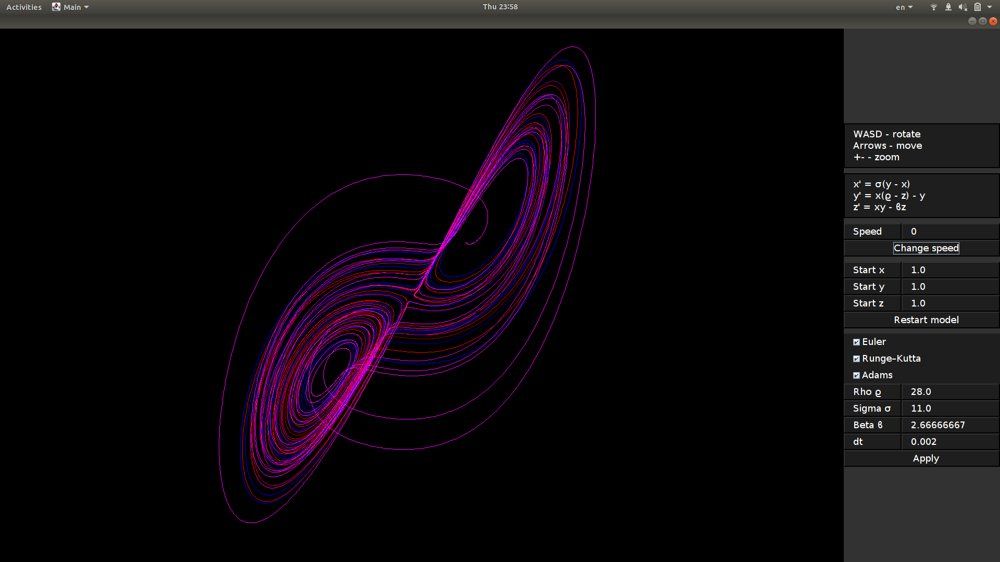

## Визуализация аттрактора Лоренца

В этом репозитории находится приложение, визуализирующее решение системы дифференциальных уравнений, известной как система Лоренца:

    x' = s (y - x)
    y' = x(r - z) - y
    z' = xy - bz

Для запуска приложения запустите Main.main():

